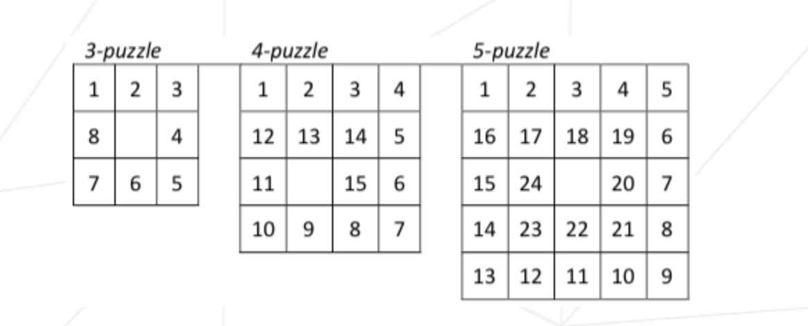

# N-PUZZLE
# GOAL
The goal of this project is to solve the N-puzzle ("taquin" in French, "pyatnashki" in Russian) game using the A* search algorithm or one of its variants (Uniform-cost or Greedy search).

We start with a square board made up of N*N cells. One of these cells is empty,
the others contain numbers, starting from 1, that is unique in this instance of the puzzle.

The search algorithm finds a valid sequence of moves in order to reach the final state, a.k.a the "snail solution", which depends on the size of the puzzle.

We used 3 heuristic functions:

◦ Manhattan-distance    
◦ Linear conflict   
◦ Misplaced tiles

# CODE
The code is written in Python using Cython for the main math functions for better efficiency. The program compiles by a Makefile using *make* or *make build* command.

The input of the program:   
◦ *make run file=boards/path_to_file.txt* - using a pre-written map with a puzzle to be solved (several maps are in the "boards" folder)    
◦ *make run* - a board will be generated by the program.    

After executing the program you can choose which version of the algorithm and heuristic you want to use.

The output of a program is: 

◦ Complexity in time (total number of states ever selected in the "opened" set)     
◦ Complexity in size (maximum number of states ever represented in memory at the same time during the search)   
◦ Number of moves required to transition from the initial state to the final state,
according to the search     
◦ Total compute time (sec)  
◦ The ordered sequence of states that make up the solution, according to the
search

The output is saved in a file and stores in *./solutions*

The puzzle may be unsolvable, in which case the program informs the user and exits